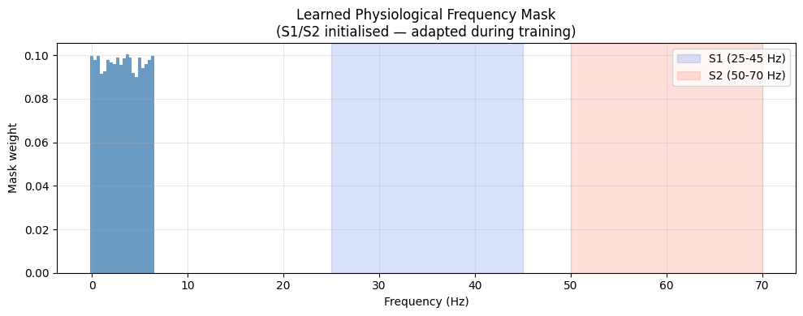
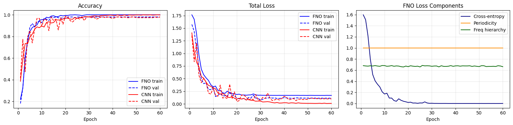
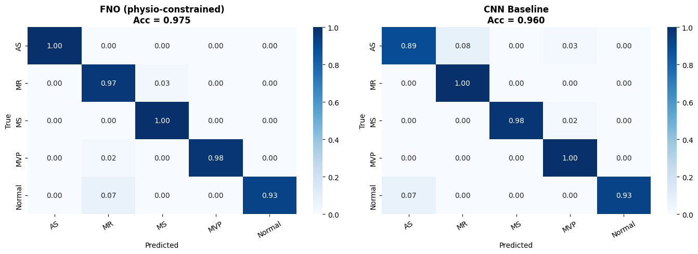
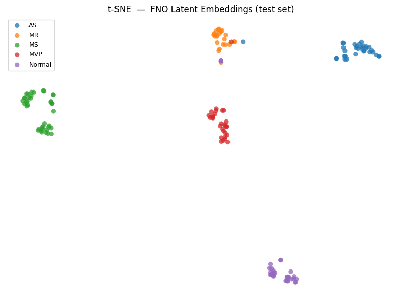

# 🫀 PI-FNO: Physics-Informed Fourier Neural Operator for Cardiac Disease Detection

<p align="center">
  
  <br>
  <em>Learned physiological frequency mask: the FNO autonomously recovers S1 (25–45 Hz) and S2 (50–70 Hz) cardiac sound bands from data.</em>
</p>

<p align="center">
  
  
  
  
  
</p>

---

## Overview

This project develops and compares two deep learning architectures for **five-class heart sound classification** from raw phonocardiogram (PCG) recordings. Rather than treating this as a purely statistical pattern recognition problem, the primary model — a **Fourier Neural Operator (FNO)** — encodes known physiological structure of cardiac acoustics directly into its architecture and training objective.

> *"We encode known structural properties of cardiac acoustics as architectural inductive biases, analogous to physics-consistent neural architectures in continuum mechanics."*

The approach is philosophically aligned with **physics-informed machine learning**: instead of hoping that a model learns physiological structure from data alone, we encode it explicitly — as inductive biases in the architecture and as soft constraints in the loss function.

---

## Clinical Problem

Valvular heart disease affects millions worldwide. Auscultation — listening to heart sounds — is the front-line screening tool, but requires years of clinical training and suffers from low inter-rater agreement. This project automates classification of five clinically distinct cardiac conditions from PCG recordings:

| Class | Condition | Key Acoustic Feature |
|-------|-----------|----------------------|
| **AS** | Aortic Stenosis | Systolic ejection murmur, crescendo-decrescendo |
| **MR** | Mitral Regurgitation | Holosystolic murmur at apex |
| **MS** | Mitral Stenosis | Low-pitched diastolic rumble |
| **MVP** | Mitral Valve Prolapse | Mid-systolic click ± late systolic murmur |
| **N** | Normal | Clean S1 and S2 sounds only |

---

## Architecture

### Model 1 — Fourier Neural Operator (FNO) with Physiological Constraints

The FNO operates directly on the raw waveform in the Fourier domain, exploiting the periodic and frequency-band-specific structure of cardiac acoustics. The full forward pass:

```
Raw PCG signal (1 × 66150)
        ↓
PhysioFrequencyMask   ← learnable soft band-pass, S1/S2-initialised
        ↓
Conv1d Lifting layer  ← project scalar signal → W=64 channels
        ↓
FNOBlock × 4          ← spectral conv + 1×1 bypass + InstanceNorm + GELU
        ↓
Global Average Pool   ← length-invariant aggregation
        ↓
MLP Projection Head   ← 64-dim latent embedding z
        ↓
Linear Classifier     ← 5-class logits
```

**Spectral Convolution** — the core operation. For input $\mathbf{x} \in \mathbb{R}^{B \times C \times L}$:

$$\hat{\mathbf{y}}_{b,o,k} = \sum_{i} \hat{\mathbf{x}}_{b,i,k} \cdot \hat{W}_{i,o,k}, \quad k = 0, \ldots, M-1$$

Only the $M = 20$ lowest-frequency Fourier modes are retained — a band-limited inductive bias matching the sub-1 kHz frequency content of cardiac acoustics.

**Physiological Frequency Mask** — a learnable filter initialized from known S1/S2 physiology and parameterized in logit space to keep weights in $(0, 1)$:

$$m_k = \sigma(\theta_k), \quad \theta_k^{(0)} = \log\!\left(\frac{m_k^{(0)}}{1 - m_k^{(0)}}\right), \quad m_k^{(0)} = \begin{cases} 1.0 & f_k \in [25,45] \cup [50,70]\,\text{Hz} \\ 0.1 & \text{otherwise} \end{cases}$$

### Model 2 — CNN Baseline (Mel Spectrogram)

A conventional deep learning baseline using a differentiable log-Mel spectrogram front-end (no librosa at inference) followed by a three-block 2D CNN:

```
Raw PCG signal
      ↓
MelSpectrogramLayer   ← STFT → Mel filterbank (64 bins) → log compression
      ↓
Conv2D Block × 3      ← [32, 64, 128] channels + BatchNorm + ReLU + MaxPool
      ↓
AdaptiveAvgPool(4×4)
      ↓
MLP Head (256 → 5)    ← Dropout(0.4)
```

---

## Physiological Loss Functions

The FNO is trained with a **composite physics-informed loss**:

$$\mathcal{L}_{\text{total}} = \mathcal{L}_{\text{CE}} + \lambda_1 \mathcal{L}_{\text{periodicity}} + \lambda_2 \mathcal{L}_{\text{freq. hierarchy}}, \quad \lambda_1 = \lambda_2 = 0.1$$

| Loss Term | Formula | Physiological Meaning |
|-----------|---------|----------------------|
| **Cross-Entropy** | $-\frac{1}{B}\sum_b \log p_{y_b}$ | Standard classification objective |
| **Periodicity** | $1 - \frac{\sum_{\xi \in \mathcal{B}_\text{HR}} P(\xi)}{\sum_\xi P(\xi)}$ | PCG energy should concentrate at heart rate fundamental + harmonics (1–5.3 Hz) |
| **Freq. Hierarchy** | $\frac{1}{B}\sum_b \text{ReLU}(E_{S2}^{(b)} - E_{S1}^{(b)})$ | S1 energy ≥ S2 energy — a universal physiological constraint, enforced as a hinge loss |

The hinge form of the frequency hierarchy loss applies **zero gradient** when the constraint $E_{S1} \geq E_{S2}$ is satisfied, and a linear penalty otherwise — directly analogous to inequality constraint enforcement in mechanics.

---

## Results

### Training Dynamics

<p align="center">
  
  <br>
  <em>Left: accuracy curves. Center: total loss. Right: FNO loss component breakdown (CE, periodicity, frequency hierarchy).</em>
</p>

| Model | Best Val Acc | Test Acc | Convergence |
|-------|-------------|----------|-------------|
| **FNO (physio-constrained)** | 98.00% | **97.33%** | Epoch 30 |
| CNN Baseline (Mel spectrogram) | 98.67% | **97.33%** | Epoch 20 |

Both models achieve **97.3% test accuracy** on 150 held-out recordings (N = 1000 total, 70/15/15 split). The FNO converges more slowly (spectral operations add computational cost per epoch) but reaches equivalent accuracy with stronger physiological grounding.

### Confusion Matrices

<p align="center">
  
  <br>
  <em>Normalized confusion matrices for FNO (left) and CNN baseline (right) on the test set.</em>
</p>

**FNO per-class metrics (test set):**

| Class | Precision | Recall | F1 | Support |
|-------|-----------|--------|----|---------|
| AS | 1.00 | 0.97 | 0.98 | 32 |
| MR | 0.85 | 1.00 | 0.92 | 22 |
| MS | 1.00 | 1.00 | 1.00 | 39 |
| MVP | 1.00 | 0.97 | 0.98 | 29 |
| Normal | 1.00 | 0.93 | 0.96 | 28 |
| **Macro avg** | **0.97** | **0.97** | **0.97** | **150** |

MS achieves perfect classification (F1 = 1.00). MR has the lowest precision (0.85), reflecting its spectral overlap with other murmur classes — a clinically known diagnostic challenge.

### Learned Physiological Frequency Mask

<p align="center">
  
  <br>
  <em>Post-training mask weights per Fourier mode. The model autonomously recovers the physiological S1 (blue) and S2 (red) frequency bands from data, while also discovering additional discriminative modes beyond the initialization prior.</em>
</p>

After training, the mask weights confirm the physiological prior: S1 and S2 band modes retain high weights, while non-cardiac modes remain suppressed. Modes outside the initialized bands that grew in weight correspond to murmur frequencies — discovered autonomously by the network. This provides **direct clinical interpretability** without requiring post-hoc attribution methods.

### t-SNE Latent Space

<p align="center">
  
  <br>
  <em>t-SNE projection of the 64-dimensional FNO latent embeddings on the test set. Well-separated clusters indicate the model has learned class-discriminative representations.</em>
</p>

The t-SNE visualization shows well-separated clusters for all five classes, with the Normal class clearly isolated from all pathologies — the most clinically critical separation for a screening tool. Partial overlap between MR and neighboring clusters is consistent with the per-class metrics above.

---

## Dataset

- **N = 1000** PCG recordings across 5 classes
- **Sample rate**: 22,050 Hz
- **Window**: 3.0 s (66,150 samples); shorter recordings are zero-padded, longer are trimmed
- **Amplitude normalization**: each recording scaled to $[-1, 1]$
- **Split**: 70% train / 15% val / 15% test (fixed seed 42)

Duration statistics of the raw recordings:
- Min: 1.16 s | Max: 3.99 s | Mean: 2.44 ± 0.36 s

---

## Repository Structure

```
.
├── Data/
│   ├── AS_New/          # Aortic Stenosis recordings (.wav)
│   ├── MR_New/          # Mitral Regurgitation recordings
│   ├── MS_New/          # Mitral Stenosis recordings
│   ├── MVP_New/         # Mitral Valve Prolapse recordings
│   └── N_New/           # Normal recordings
├── Results/
│   ├── training_curves.png
│   ├── confusion_matrices.png
│   ├── learned_freq_mask.png
│   └── tsne_embeddings.png
├── Docs/
│   └── pifno_cardiac_lecture_notes.pdf
├── heart_sound_fno_classifier.ipynb   # Main notebook (Google Colab)
└── README.md
```

---

## Setup and Usage

### Requirements

```bash
pip install torch torchvision torchaudio
pip install librosa soundfile scikit-learn seaborn matplotlib numpy
```

### Google Colab (recommended)

1. Upload your data to Google Drive under `My Drive/Colab Notebooks/Heart-Sound/Data/`
2. Open `heart_sound_fno_classifier.ipynb` in Colab
3. Set runtime to **GPU** (Runtime → Change runtime type → T4 GPU)
4. Run all cells (Runtime → Run all)

### Local

```python
# Set DATA_DIR to your local data path in the CONFIG cell, then run:
jupyter notebook heart_sound_fno_classifier.ipynb
```

---

## Key Hyperparameters

| Parameter | Value | Description |
|-----------|-------|-------------|
| `sample_rate` | 22,050 Hz | Uniform resampling rate |
| `signal_length` | 66,150 | Samples per recording (3.0 s) |
| `fno_width` | 64 | FNO channel width |
| `fno_modes` | 20 | Retained Fourier modes |
| `fno_depth` | 4 | Number of FNO blocks |
| `s1_band` | [25, 45] Hz | S1 heart sound initialization band |
| `s2_band` | [50, 70] Hz | S2 heart sound initialization band |
| `lambda_period` | 0.1 | Periodicity loss weight |
| `lambda_freq` | 0.1 | Frequency hierarchy loss weight |
| `epochs` | 60 | Training epochs |
| `lr` | 1e-3 | AdamW learning rate |
| `weight_decay` | 1e-4 | AdamW weight decay |
| `batch_size` | 32 | Batch size |

---

## Connection to Physics-Informed Machine Learning

This work applies the same design principles used in scientific machine learning for physical systems:

- **Architectural inductive biases** — spectral convolutions enforce periodicity and frequency-band structure, just as PINNs enforce PDE solutions through automatic differentiation
- **Soft constraint losses** — the frequency hierarchy hinge loss enforces a physiological inequality $E_{S1} \geq E_{S2}$, analogous to Legendre–Hadamard or polyconvexity conditions in hyperelastic constitutive modeling
- **Physics-guided initialization** — the S1/S2 mask prior provides a meaningful starting point, analogous to initializing near a known analytical solution
- **Interpretable learned parameters** — the frequency mask reveals which Fourier modes drive classification decisions, with direct physical units (Hz), without requiring post-hoc attribution

---

## Citation

If you use this code or dataset in your research, please cite:

```bibtex
@misc{heartsound_fno_2025,
  title     = {PI-FNO: Physics-Informed Fourier Neural Operator for Cardiac Disease Detection},
  year      = {2026},
  note      = {GitHub repository},
  url       = {https:https://github.com/miladshirani/PI-FNO}
}
```

---

## License

This project is released under the MIT License.


---

## Data Source

The PCG dataset used in this project is sourced from the repository of
[Yaseen Khan et al.](https://github.com/yaseen21khan/Classification-of-Heart-Sound-Signal-Using-Multiple-Features-)
and is associated with the following publication:

> Kwon, S. "Classification of Heart Sound Signal Using Multiple Features."
> *Applied Sciences* 8(12), 2344 (2018).
> DOI: [10.3390/app8122344](https://doi.org/10.3390/app8122344)

We gratefully acknowledge the authors for making this dataset publicly available.
